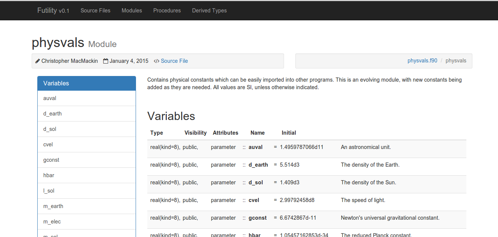

#FORD
This is an automatic documentation generator for modern Fortran programs.
FORD stands for FORtran Documenter. As you may know, "to ford" refers to
crossing a river (or other body of water). It does not, in this context, refer
to any company or individual associated with cars.

Ford was written due to [Doxygen](http://www.stack.nl/~dimitri/doxygen/)'s
poor handling of Fortran and the lack of comparable alternatives.
[ROBODoc](http://rfsber.home.xs4all.nl/Robo/index.html) can't actually extract
any information from the source code and just about any other automatic
documentation software I found was either proprietary, didn't work very well
for Fortran, or was limited in terms of how it produced its output.
[f90doc](http://erikdemaine.org/software/f90doc/) is quite good and I managed
to modify it so that it could handle most of Fortran 2003, but it produces
rather ugly documentation, can't provide as many links between different parts
of the documentation as I'd like, and is written in Perl (which I'm not that
familiar with and which lacks the sort of libraries found in Python for
producing HTML content).

The goal of FORD is to be able to reliably produce documentation for modern
Fortran software which is informative and nice to look at. The documentation
should be easy to write and non-obtrusive within the code. While it will never
be as feature-rich as Doxygen, hopefully FORD will be able to provide a good
alternative for documenting Fortran projects.

##Capabilities
Current features include:

- the ability to extract information about variables, procedures, procedure
  arguments, derived types, programs, and modules from the source code.
- the ability to extract documentation from comments in the source code.
- LaTeX support in documentation using [MathJax](http://www.mathjax.org/).
- searchable documentation, using [Tipue Search](http://www.tipue.com/search/).
- author description and social media (including Github!) links.
- links to download the source code.
- links to individual files, both in their raw form or in HTML with syntax
  highlighting.
- use of Markdown to type-set documentation.
- links between related parts of the software.
- Bootstrap CSS for the documentation, making it both functional and pretty.
- configurable settings.

##Disclaimer
This is a young project. While it has bee tested somewhat, the testing has been
far from comprehensive. Various options have not been tested and obscure uses
of the Fortran syntax could still potentially cause FORD to crash. If you
get an error message while processing a file, first check to make sure that the
file actually compiles. No effort has been made to be able to process files
which contain syntax errors. Next ensure that you aren't using any of the
lingering FORTRAN77 syntax. If you are still experiencing errors, comment
out the ``try``/``except`` statement on lines 59-63 of
./ford/fortran_project.py. Leave only line 60 uncommented. You will probably
need to remove four spaces from line 60's indentation, as well.
This will give you
a proper Python backtrace. Submit a bug report on this Github page, including
the backtrace and, if possible, the file which FORD crashed while processing.
If an error occurs elsewhere, you will most likely get a backtrace by default.
Once again, please include this backtrace in your bug report.

##Installation
The simplest way to install FORD is using [pip](https://pip.pypa.io/en/latest/).
This can be done with the command

    sudo pip install ford

Pip will automatically handle all dependencies for you. If
you do not have administrative rights on the computer where you want to produce
documentation, pip will allow you to install FORD and its dependencies in a
[virtualenv](https://virtualenv.pypa.io/en/latest/) located somewhere in
your home directory.

If you prefer, you can install all of those dependencies manually and clone
FORD from Github. Then place FORD somewhere in your PYTHONPATH.

##Dependencies
In addition to the standard Python libraries, the following modules are needed:

- [Jinja2](http://jinja.pocoo.org/docs/dev/)
- [Pygments](http://pygments.org/)
- [toposort](https://pypi.python.org/pypi/toposort/1.0)
- [Markdown](https://pythonhosted.org/Markdown/)
- [Beautiful Soup](http://www.crummy.com/software/BeautifulSoup/bs4/doc/)
- [Markdown-Include](https://pypi.python.org/pypi/markdown-include/0.1)

All of these can be installed via pip. If
you install FORD itself via pip then the dependencies will be handled
automatically.

##Basic Usage
FORD usage is based on _projects_. A project is just whatever piece of software
you want to document. Normally it would either be a program or a library. Each
project will have its own
[Markdown](http://daringfireball.net/projects/markdown/syntax) file which
contains a description of the project. Various options (see below for a
description) can be specified in this file, such as where to look for your
projects source files, where to output the documentation, and information about
the author. See
[./example-project-file.md](https://github.com/cmacmackin/ford/blob/master/example-project-file.md)
for a sample project file.

###Running Ford
Once you have written a project file which you're satisfied with, it is time to
run FORD. Make sure that it is in the path/Python-path. The most basic syntax
for running ford is just

```
ford project-file.md
```

Assuming that there are no errors, your documentation will now be available
in the path you indicated for output. Please be aware that FORD will delete
anything already present in the specified project-path. Use caution with this,
lest you accidentally end up deleting something important.

###Writing Documentation
All documentation, both that provided within the source files and that given
in the project file, should be written in
[Markdown](http://daringfireball.net/projects/markdown/syntax). In addition
to the standard Markdown syntax, you can use all of the features in Python's
[Markdown Extra](https://pythonhosted.org/Markdown/extensions/extra.html). Other
Markdown extensions automatically loaded are
[CodeHilite](https://pythonhosted.org/Markdown/extensions/code_hilite.html)
which will provide syntax highlighting for any code fragments you place in your
documentation
and [Meta-Data](https://pythonhosted.org/Markdown/extensions/meta_data.html).
The latter is used internally as a way for the user to provide extra information
to and/or customize the behaviour of FORD. Information on providing meta-data
and what types of data FORD will look for can be found in the next section.

In modern (post 1990) Fortran, comments are indicated by an exclamation mark
(!). FORD will ignore a normal comment like this. However, comments with two
exclamation marks (!!) are interpreted as documentation and will be captured
for inclusion in the output. If desired, the character(s) designating
documentation can be changed (see below). FORD documentation must come
_after_ whatever it is that you are documenting, either at the end of the line
or on a subsequent line. This was chosen because it was felt it is easier to
make your documentation readable from within the source-code this way. This

```fortran
subroutine feed_pets(cats, dogs, food, angry)
    !! Feeds your cats and dogs, if enough food is available. If not enough
    !! food is available, some of your pets will get angry.

    ! Arguments
    integer, intent(in)  :: cats
        !! The number of cats to keep track of.
    integer, intent(in)  :: dogs
        !! The number of dogs to keep track of.
    real, intent(inout)  :: food
        !! The ammount of pet food (in kilograms) which you have on hand.
    integer, intent(out) :: angry
	    !! The number of pets angry because they weren't fed.
		
    !...
    return
end subroutine feed_pets
```

looks better/more readable than

```fortran
!! Feeds your cats and dogs, if enough food is available. If not enough
!! food is available, some of your pets will get angry.
subroutine feed_pets(cats, dogs, food, angry)

    ! Arguments
    !! The number of cats to keep track of.
    integer, intent(in)  :: cats
    !! The number of dogs to keep track of.
    integer, intent(in)  :: dogs
    !! The ammount of pet food (in kilograms) which you have on hand.
    real, intent(inout)  :: food
    !! The number of pets angry because they weren't fed.
    integer, intent(out) :: angry
		
    !...
    return
end subroutine feed_pets
```

in the opinion of this author, especially with regards to the list of arguments.
Unfortunately, if you disagree, it is unlikely that there will ever be a switch
available to change this behaviour, as it would require a drastic rewrite of
large parts of the structure of the code.

Please note that legacy Fortran (fixed-form code) is not supported at this
time. If anyone would like to contribute the necessary modifications to
./ford/reader.py to convert fixed-form syntax into free-form, it should not be
difficult (see the approach taken by
[f90doc](http://erikdemaine.org/software/f90doc/)). However, it is not a
priority for me right now (since I regard fixed-form Fortran as an
abomination which should be wiped from the face of this Earth).

You can insert LaTeX into your documentation, which will be rendered by
[MathJax](http://docs.mathjax.org). Inline math is designated by \\( &hellip; \\),
math displayed on its own line is indicated by $$ &hellip; $$ or \\[ &hellip; \\],
and a numbered equation is designated by \\begin{equation} &hellip;
\\end{equation}. Inline math will not be displayed with the traditional
$ &hellip; $, as there is too much risk that dollar signs used elsewhere will be
misinterpreted. You can refer back to number equations as you would in a LaTeX
document. For more details on that feature, see the
[MathJax Documentation](http://docs.mathjax.org/en/latest/tex.html#automatic-equation-numbering).

Much like in Doxygen, you can use a ``@note`` environment to place the succeeding
documentation into a special boxed paragraph. This syntax may be used at any location
in the documentation comment and it will include as the note's contents anything until
the end of the paragraph. Other environments which behave the same way are ``@warning``,
``@todo``, and ``@bug``. Note that these designations are case-insensitive (which, as
Fortran programmers, we're all used to). If these environments are used within
the first paragraph of something's documentation and you do not manually specify
a summary, then the environment will be included in the summary of your
documentation. If you do not want this to occur, just place the environment
in a paragraph of its own.

Finally, FORD uses my [Markdown-Include](https://github.com/cmacmackin/markdown-include)
extension. The syntax ``{{file-name.md}}`` in any of your documentation will be replaced
by the contents of file-name.md. This will be the first thing done when processing
Markdown, and thus all Markdown syntax within file-name.md will be processed correctly.
You can nest these include statments as many times as you like. All file paths are
evaluated relative to the directory containing the project file, unless set to do
otherwise.

###Output
Output is in HTML. By default, all links will be relative, meaning that the
output can be placed and viewed anywhere. The
[Bootstrap](http://getbootstrap.com/) framework was used to make it easy to
quickly design professional looking pages. An example of some output, generated
from the code fragment above, is shown below.




##Options
While not nearly as configurable as the likes of
[Doxygen](http://www.stack.nl/~dimitri/doxygen/), FORD's output can still be
customized to some extent by users.

###Command-Line Options
The command-line interface is given below:

```
ford.py [-h] [-d PROJECT_DIR] [-o OUTPUT_DIR] [-s CSS]
             [--exclude EXCLUDE] [-e [EXTENSIONS [EXTENSIONS ...]]]
             project_file
```

<dl>
  <dt>PROJECT_DIR</dt>
  <dd>The directory where the source-files are to be found for
  this project. This must not be a subdirectory of the OUTPUT_DIR (see
  below).</dd>
  <dt>OUTPUT_DIR</dt>
  <dd>The directory where the project output will be placed.
  <strong>Any content already present there will be deleted.</strong></dd>
  <dt>CSS</dt>
  <dd>The path to a custom style-sheet which can be used to modify the
  appearance of the output.<dd>
  <dt>EXCLUDE</dt>
  <dd>A source file which should not be read. If you want to specify more than
  one then you will need to do it in the project file.<dd>
  <dt>EXTENSIONS</dt>
  <dd>File extensions which will be read by FORD for documentation.
  (<em>default:</em> f90, f95, f03, f08)</dd>
  <dt>project_file</dt>
  <dd>The file containing a description of your project and various settings
  for FORD.</dd>
</dl>

Settings specified at the command-line will override those specified in the
project file.

###Project File Options
You can specify various options and information for your project in the
meta-data of your project file. Quoting from the
[Markdown Meta-Data](https://pythonhosted.org/Markdown/extensions/meta_data.html)
page:

> Meta-data consists of a series of keywords and values defined at the beginning of a markdown document like this:
>
> <pre>Title:   My Document<br>Summary: A brief description of my document.<br>Authors: Waylan Limberg<br>         John Doe<br>Date:    October 2, 2007<br>blank-value: <br>base_url: http://example.com
>
>This is the first paragraph of the document.</pre>
>The keywords are case-insensitive and may consist of letters, numbers, underscores and dashes and must end with a colon. The values consist of anything following the colon on the line and may even be blank.
>
>If a line is indented by 4 or more spaces, that line is assumed to be an additional line of the value for the previous keyword. A keyword may have as many lines as desired. \[Note that these **must** be spaces and not tabs.\]
>
>The first blank line ends all meta-data for the document. Therefore, the first line of a document must not be blank. All meta-data is stripped from the document prior to any further processing by Markdown.

The options which can be specified in the meta-data are listed below. Defaults
are included in the description, if they exist.
<dl>
<dt>project</dt><dd>The name of this project.
  (<em>default:</em> Fortran Project)</dd>
<dt>summary</dt><dd>A summary of the description of your project. If present
  it will be printed in a "Jumbotron" element at the top of the documentation
  index page. This will be processed by Markdown before being used.</dd>
<dt>project_url</dt><dd>The URL at which the documentation will be available. If
left blank then relative URLs will be used for links. (<em>default:</em> blank,
  i.e. relative links)</dd>
<dt>project_dir</dt><dd>The directory where the source-files are to be
  found for this project. This must not be a subdirectory of the output_dir (see
  below). (<em>default:</em> ./src)</dd>
<dt>output_dir</dt><dd>The directory where the project output will be placed.
  <strong>Any content already present there will be deleted.</strong>
  (<em>default:</em> ./doc)</dd>
<dt>media_dir</dt><dd>A directory containing any images or other content which
  you will use or link to in your documentation. This will be placed at the root
  of your documentation file-tree, with the name "media". To link to this
  content from the index (i.e. from the description and summary provided in the
  project file) you would use <code>./media/<file-name></code>, while it would be
  <code>../media/<file-name></code> from anywhere else.</dd>
<dt>md_base_dir</dt><dd>The directory relative to which any "included" Markdown
  files' paths are specified. (<em>default:</em> directory containing the project
  file.)</dd>
<dt>css</dt><dd>The path to a custom style-sheet which can be used to modify the
  appearance of the output.</dd>
<dt>md_extension</dt><dd>The name of any Markdown extensions which you wish to be used
  when parsing your documentation. For example, 'markdown.etensions.toc'. Note that
  Markdown-Extra, CodeHilite, and Meta-Data are loaded by default.</dd>
<dt>extensions</dt><dd>File extensions which will be read by FORD for
  documentation. Each extension must be on its own line.
  (<em>default:</em> f90, f95, f03, f08)</dd>
<dt>exclude</dt><dd>A source file which should not be read. Each excluded file
  must be on its own line. Provide only the file name, not the full path.</dd>
<dt>docmark</dt><dd>The symbol(s) following an exclaimation mark which
  designates that a comment contains documentation. For excample, if the docmark
  was <code>></code>, comments would then be designated by <code>!></code>. The docmark
  can be
  anything you like, as long as it does not contain something which (ordinarily)
  has special meaning for regular expressions. Thus, '*', '+', and '?'
  would not be valid and would yield incorrect results. (<em>default:</em>
  '!')</dd>
<dt>display</dt><dd>How much documentation should be printed. Options are
  'public', 'private', 'protected', or any combination of those three. Each
  choice must be on its own line. (<em>default:</em> 'public' and 'protected')
  </dd>
<dt>version</dt><dd>The version name/number of your project.</dd>
<dt>year</dt><dd>The year to display in the copyright notice. (<em>default:</em>
  the current year)</dd>
<dt>project_github</dt><dd>The URL of the Github repository for this project.
  </dd>
<dt>project_bitbucket</dt><dd>The URL of the BitBucket repository for this
  project.</dd>
<dt>favicon</dt><dd>The path to a custom favicon which will be used by the HTML
  documentation. If left blank, it will default to an icon for FORD.</dd>
<dt>project_sourceforge</dt><dd>The Sourceforge repository for this project.
  </dd>
<dt>project_download</dt><dd>A URL from which to download the source or
  binaries for this project.</dd>
<dt>project_website</dt><dd>The homepage for this project.</dd>
<dt>author</dt><dd>The name of the person(s) or organization who wrote this
  project.</dd>
<dt>author_description</dt><dd>A brief description of the author. You could
  provide biographical details or links to other work, for example. This will
  be processed by Markdown before being used.</dd>
<dt>author_pic</dt><dd>A picture of or avatar for the author.</dd>
<dt>github</dt><dd>The author's Github page.</dd>
<dt>bitbucket</dt><dd>The author's BitBucket page.</dd>
<dt>facebook</dt><dd>The author's Facebook profile.</dd>
<dt>twitter</dt><dd>The author's Twitter.</dd>
<dt>google_plus</dt><dd>The author's Google+</dd>
<dt>linkedin</dt><dd>The author's LinkedIn profile.</dd>
<dt>email</dt><dd>The author's email address.</dd>
<dt>website</dt><dd>The author's website.</dd>
</dl>

See
[./example-project-file.md](https://github.com/cmacmackin/ford/blob/master/example-project-file.md)
for a sample project file.

###Meta-Data in Documentation
When documenting your source files you can provide meta-data at the top of an
item's documentation. There can not be any other documentation before it; not
even a blank line of documentation. This will work
```fortran
! Good
type :: cat
  !! author: C. MacMackin
  !! version: v0.2
  !!
  !! This data-type represents a cat.
```
but this won't
```fortran
! Bad
type :: cat
  !!
  !! author: C. MacMackin
  !! version: v0.2
  !!
  !! This data-type represents a cat.
```
The meta-data will be displayed for procedures, derived types,
files, programs, modules, type-bound procedures, and interfaces. It may be
displayed in more cases in future. Recognized types of meta-data are:

<dl>
  <dt>author</dt><dd>The author of this part of the code</dd>
  <dt>date</dt><dd>The date that this part of the code was written (or that the
  documentation was written; whichever makes more sense to you).</dd>
  <dt>license</dt><dd>The license for this part of your code. If you want
  to provide a link then it will have to be in HTML, as it won't be processed
  by Markdown.</dd>
  <dt>version</dt><dd>The version number (or name) of this part of the
  code.</dd>
  <dt>category</dt><dd>A category for this part of the code. In future, FORD may
  provide lists of things in each category. Currently it is primarily
  decorative, although it is used when the documentation is being searched.</dd>
  <dt>summary</dt><dd>A brief description of this part of the code. If not
  specified, then FORD will use the first paragraph of the body of your
  documentation.</dd>
  <dt>deprecated</dt><dd>If this is present and not <code>False</code> then a
  label saying "Deprecated" will be placed in the documentation.</dd>
</dl>


##ToDo
This software is still extremely young and much remains to be done. Various
things which I'd like to do at some point include:

- Support some of the old Fortran 77 ways of doing things, as these are often
  still used. This includes PARAMETER statements and EXTERNAL statements.
  Support for fixed-form code is less of a priority.
- Add the ability to produce dependency diagrams and inheritance diagrams for
  modules and types, respectively.
- Make more options configurable from the command-line.
- Test on some more code, including that of other people, who may have different
  coding styles.
- Add the ability to identify function calls and use this to work out
  call-trees (subroutine calls are already captured, although not yet used
  in any of the output).
- Add the option for users to specify a Creative Commons license for their
  documentation, which will be inserted into the page footer.
- Make it possible to override the display options within a particular
  part of the code and/or for an individual item within the code.
- Provide an option to force all (non-string) text which is captured to be
  lower case.
- Add the ability to recognize the use of intrinsic modules
- Add the ability to allow for ``only`` statements when loading modules and for
  renaming module procedures when loading them.
- Improve the sidebar for source files so that it will link to the items that it
  lists.
- Improve the way procedures are handled as arguments. In particular, allow
  any abstract interface which was used as a template to be visible somehow.

Things which ideally I would do, but are not currently on the radar include:

- Add the ability for people to customize appearance of the output more (this
  would require drastic changes to the template system).
- Support fixed-form Fortran (doable, but low priority).
- Add the ability to identify type-bound procedure calls and use these to
  construct call-trees. This would be extremely difficult, as it would
  require keeping track of names and types of variables throughout the code.


<!--
##Approach
The basic algorithm for generating the documentation is as follows:

- Get instructions from user. These are to be passes as command-line arguments
  and meta-data within the project file.
- Parse each file which is to be documented.
   - Create a file object. This will contain any documentation meant for the
     file as a whole and a list of any file contents.
   - Create module, subroutine, function, and/or program objects for each of
     these structures within the file. Each of these objects will also store
	 comments, contents, and parameters.
   - Continue to recurse into these structures, adding interface, type,
     variable, subroutine and function objects as necessary.
- Perform further analysis on the parsed code, correlating anything defined
  in one place but used in another. This will be used to generate hyperlinks
  when producing the documentation.
- Convert comments into HTML. Assume that they have been written in Markdown.
  Also make sure to process LaTeX (not yet implemented).
- Produce the documentation. This will be done using Jinja2 templates.
-->
