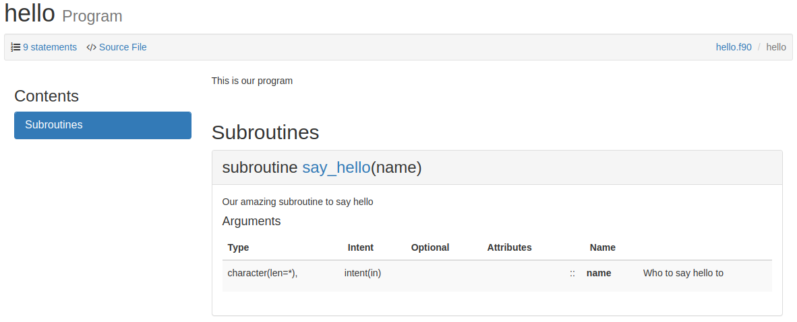

=================
 Getting Started
=================

FORD generates pretty HTML documentation from comments in your Fortran
source code. It will automatically create lists of all the functions,
subroutines, derived types, modules, and programs in your project,
along with cross-references and links between them. It can also
generates graphs of which entities use which others.

To get started using FORD, we'll first need to install the package
(see `sec-installation` on details of how to do this), and then we'll
need to create a "project file" that contains options for FORD and a
description of our project.

Here's a simple project file, ``my_project.md``

.. code:: text

    ---
    project: My Fortran project
    author: Me
    ---

    This is my Fortran project!

We'll also need some Fortran source code to document. By default, FORD
looks for ``.f90`` files (along with `other extensions
<option-extensions>`) in ``./src`` -- this is relative to where you
run ``ford``.

FORD extracts documentation from special comments in our source
code. By default, these are comments after some entity [#entities]_ that begin with
a double exclamation mark: ``!!``

Let's create ``src/hello.f90`` with some FORD comments:

.. code:: fortran

   program hello
     !! This is our program
     implicit none

     ! This is just a normal comment
     call say_hello("World!")

   contains

     subroutine say_hello(name)
       !! Our amazing subroutine to say hello
       character(len=*), intent(in) :: name
         !! Who to say hello to
       write(*, '("Hello, ", a)') name
     end subroutine say_hello

   end program hello

Here we've documented the program ``hello``, the subroutine
``say_hello``, and the input variable ``name``.

We can now run FORD:

.. code:: console

   $ ford my_project.md
   Reading file src/hello.f90

   Processing documentation comments...
   Correlating information from different parts of your project...

   Creating HTML documentation...
   Creating search index: 100%|███████████████████| 3/3 [00:00<00:00, 45.97/s]

   Writing documentation to '/home/ford/hello/doc'...

   Browse the generated documentation: file:///home/ford/hello/doc/index.html

And now we can view the documentation in our browser at
``doc/index.html``. Here's what the page for the ``hello`` program
looks like:

.. rubric:: Footnotes

.. [#entities] An "entity" is any documentable Fortran "thing":
               variables, modules, programs, functions, subroutines,
               derived types, enums are all entities.
