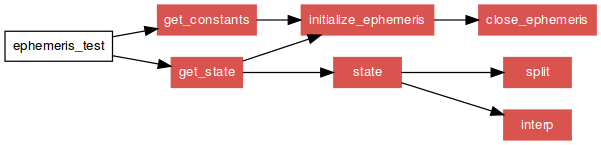

==============
 Running FORD
==============

Once you have written a project file which you’re satisfied with, it is
time to run FORD. The most basic syntax for running ford is just

::

   ford project-file.md

More advanced `command line options <sec-command-line-options>` are
available. Assuming that there are no errors, your documentation will
now be available in the path you indicated for output. Please be aware
that FORD will delete anything already present in the specified
project-path. Use caution with this, lest you accidentally end up
deleting something important.

Output is in HTML. By default, all links will be relative, meaning that
the output can be placed and viewed anywhere. The
`Bootstrap <http://getbootstrap.com/>`__ framework was used to make it
easy to quickly design professional looking pages. An example of some
output is shown here.

.. figure:: output-example.png
   :alt: Some example output.

   Some example output.

If you have the `graph
feature <option-graph>`
turned on, then you can expect FORD to produce call-graphs (among other
types of graphs) like that shown below: |A sample call-graph|

