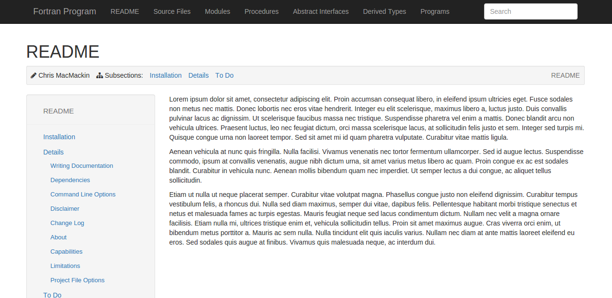

.. _sec-writing-pages:

==============
 Static Pages
==============

If a ``page_dir`` is specified in the metadata of your project file,
then FORD will produce a set of pages from the contents of this
directory. These pages will not be associated with any source code. The
“homepage” for this documentation will be a file by the name of
``index.md`` in ``page_dir``.

Writing Pages
-------------

Pages are written in Markdown and their files must have the extension
``.md`` (otherwise they will not be processed). All of the same Markdown
extensions will be available here as were when processing the project
description and any documentation. Files may have the following
metadata:

-  **title**: the name of the page (*required*)
-  **author**: the author of the page (*optional*)
-  **date**: the date the page was written (*optional*)
-  **ordered_subpage**: a list of sub-pages to be linked in order in the
   table of contents (*optional*)
-  **copy_subdir**: a list of subdirectories to copy verbatim into
   generated documentation (*optional*)

For **ordered_subpage** and **copy_subdir** which take a list of
arguments, you need to repeat the keyword for each item like so:

::

   ordered_subpage: subpage3
   ordered_subpage: subpage1

`Links <writing-links>` to the source documentation can be used in the
same way as from within the documentation.

Hierarchy
---------

It is possible to have subpages, nested to an arbitrary level. This is
achieved using the directory hierarchy within ``page_dir``. Each
directory represents a page and all of its subpages. The page which a
directory represents must have the file-name ``index.md``, or else that
directory will be skipped by FORD. Any other Markdown files within the
directory correspond to subsidiary pages in the hierarchy. And
subdirectories correspond to subsidiary pages which themselves have
subsidiary pages.

For example, the following directory structure (with page titles given
in parentheses)

.. code:: text

   page_dir
   ├── index.md (README)
   ├── changelog.md (ChangeLog)
   ├── equations.md (Fluid Equations)
   ├── examples
   |   ├── index.md (Example Simulations)
   |   ├── shock.md (1D shock tube)
   |   └── collapse.md (Collapsing gas cloud)
   └── todo.md (ToDo)

would produce the following page hierarchy

.. code:: text

   README
   ├── ChangeLog
   ├── Fluid Equations
   ├── Example Simulations
   |   ├── Collapsing gas cloud
   |   └── 1D shock tube
   └── ToDo

The directory structure will be reproduced within the output
documentation. The HTML files will have the same names as the original
Markdown files, except that the extension is now ``.html``. Because the
directory structure is preserved, if the user wishes to provide links
between pages then relative links can be used as though the links were
being made between the Markdown files (remembering to make the extension
``html`` rather than ``md``). Note that all non-Markdown files will be
copied into the output directory hierarchy, so relative links to them
(e.g. links to images) can also be relative. If you want to refer to a
page from the documentation in source files you can make use of the
``|page|`` alias to refer to the ``page_dir`` of the project (prefix the
relative links as described above with ``|page|``.

Within the documentation, pages will be listed in the order of their
file names sorted alphabetically. If you want to have sub-pages included
in a certain order, you can specify them with **ordered_subpage**:

::

   title: title of the page
   ordered_subpage: subpage3
   ordered_subpage: subpage1

The subpages can be another markdown file or a folder. If it is a folder
it has to contain again an ``index.md`` file where you can order the
sub-sub-pages adding them using **ordered_subpages** in a similar way.

If some file is not added as **ordered_subpage** it will be added to the
documentation at the end of the corresponding level. If no file is in
the list, the standard ordering is used.

.. _sec-copy_subdir:

Copying directories: **copy_subdir**
------------------------------------

This option allows the user to specify subdirectories that are to be
copied verbatim into the generated documentation directory.

This setting can also be set in the individual ``index.md`` within the
page_dir hierarchy. The option allows a convenient collection of
supportive files within the page_dir hierarchy, for example to provide
images.

Example: project configured with (``copy_subdir: media``) in the
``main.md``.

Assume the following page_dir structure:

.. code:: text

   page_dir/
       |- index.md (copy_subdir: images)
                   (copy_subdir: plots)
       |- media/
       |- plots/
       |- images/
       |- subtutorial_01/
           |- index.md (copy_subdir: )
           |- media/
       |- subtutorial_02/
           |- index.md (<no option set in file>)
           |- media/

This should produce the a documentation directory as follows:

.. code:: text

   page/
       |- index.html
       |- plots/
       |- images/
       (media subdirectory not copied, as overwritten in local index.md)
       |- subtutorial_01/
           |- index.html
          (media subdirectory not copied, as overwritten in local index.md)
       |- subtutorial_02/
           |- index.html
           |- media/ (copied due to project settings)

Example
-------

An example of how pages are displayed within the documentation FORD
produces is given below. |FORD page hierarchy output.|

